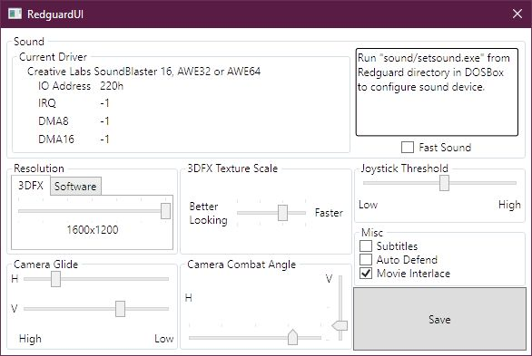

# RedguardUI
Configuration tool for The Elder Scrolls Adventures: Redguard

Some of the settings in Redguard (such as camera adjustments) are only available from the launcher. Said launcher looks for registry keys and therefore requires the game to be properly installed, which is not the case with the GOG version. While the configuration file is easy to edit, it lacks guidelines. This tool is meant to mimic the said options screen for easier editing.

**IMPORTANT**: Keep copies of SYSTEM.INI in case something goes wrong. Sound configs are safe.

Requires .NET Core 3.1 to run (supported on Win7 and up).

## Installation
Just drop the compiled files in the main game directory. Sound configuration is done with SETSOUND program so that section is there just for show.

## To-Do
- Make it more WPF-esque
